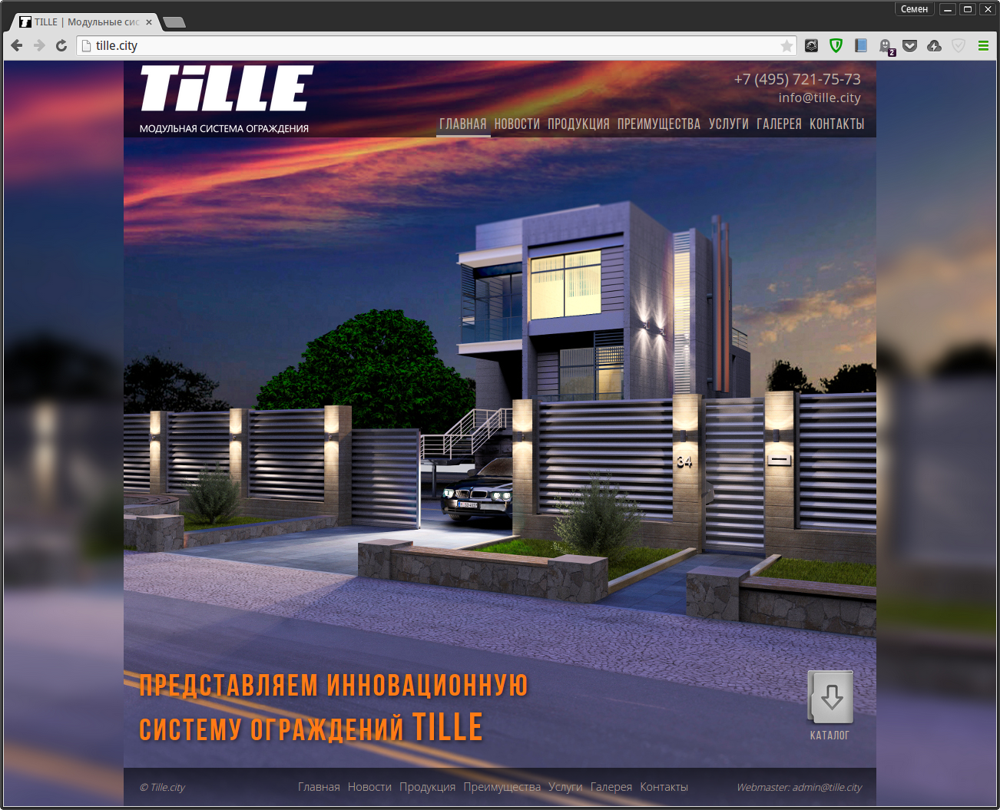
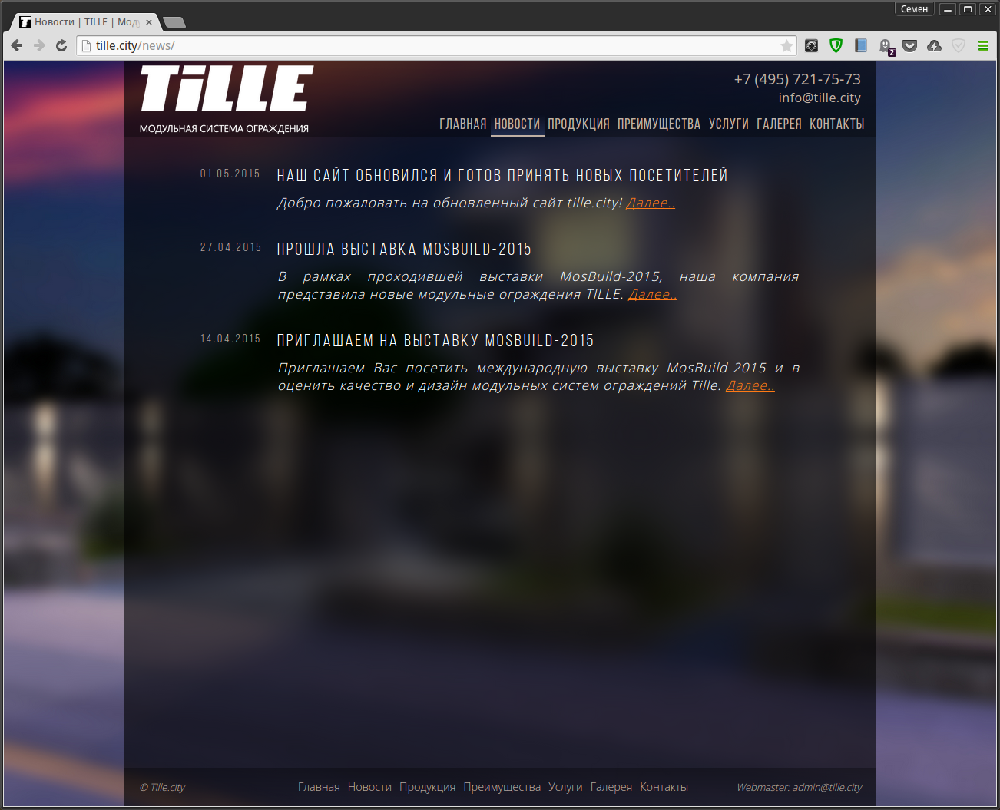
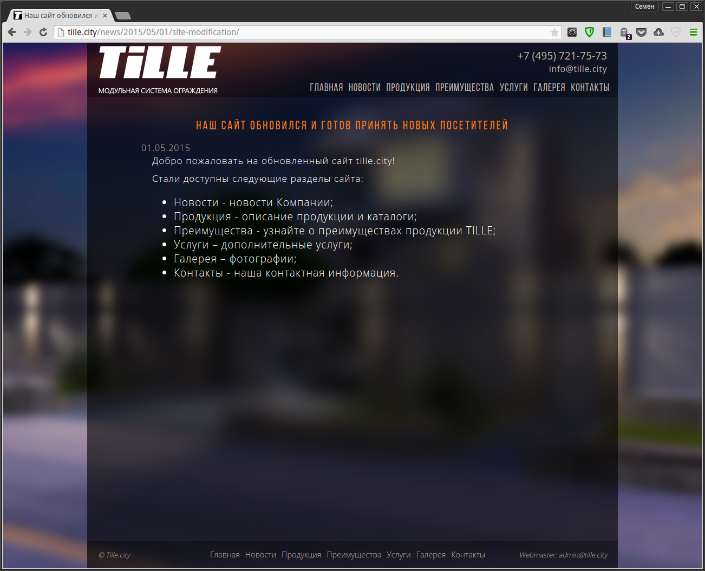
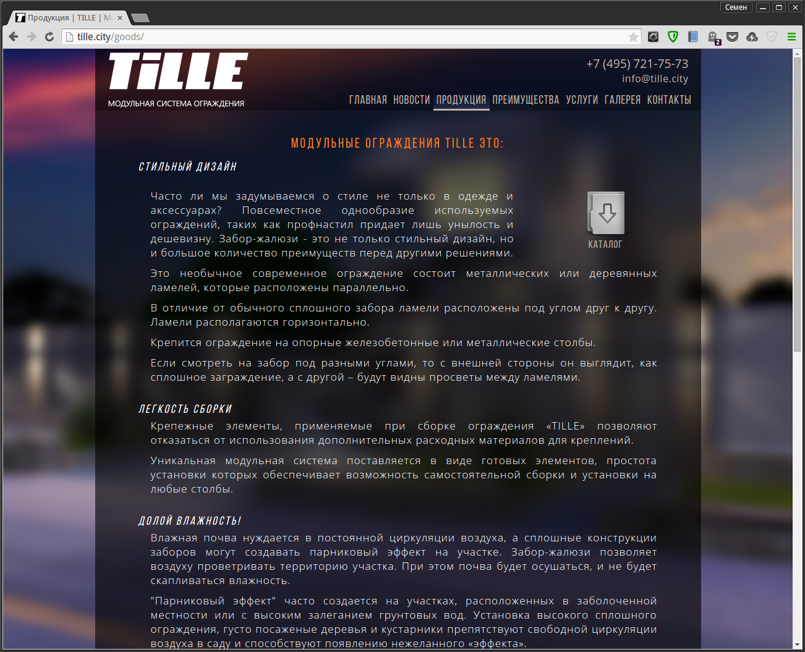
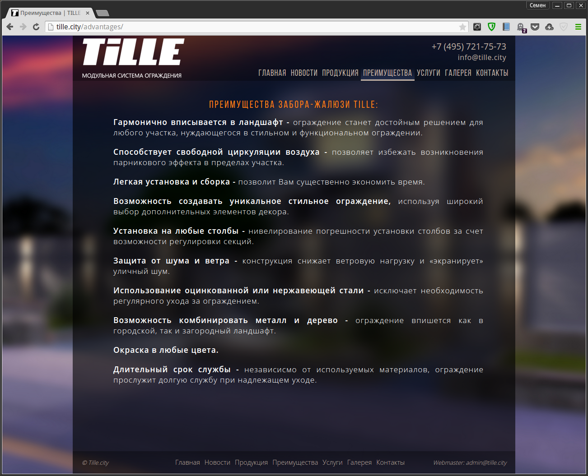
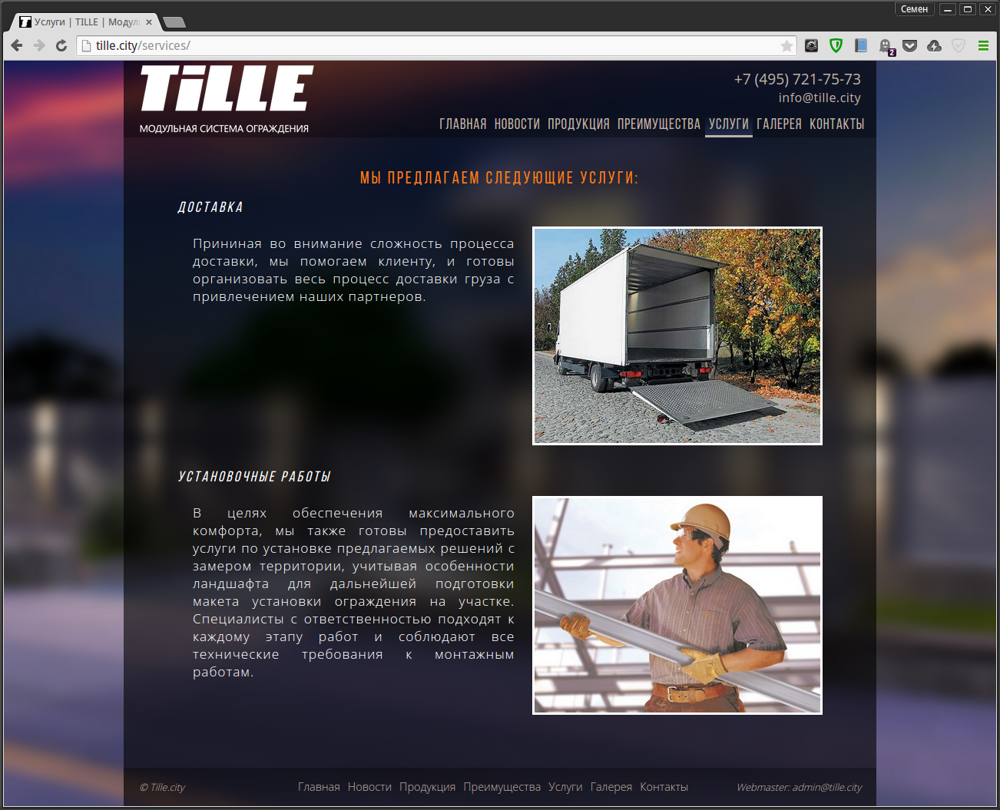
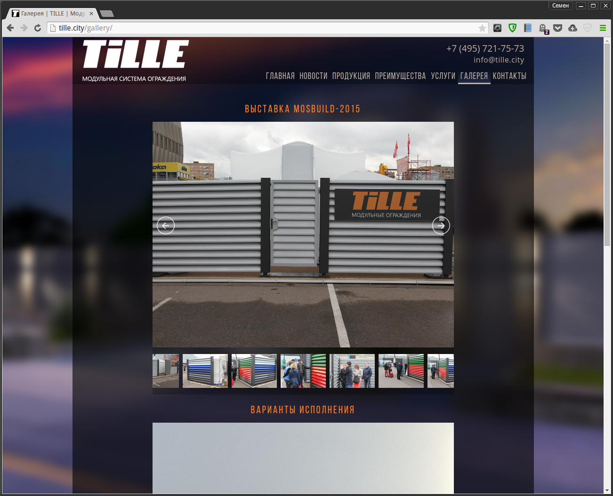
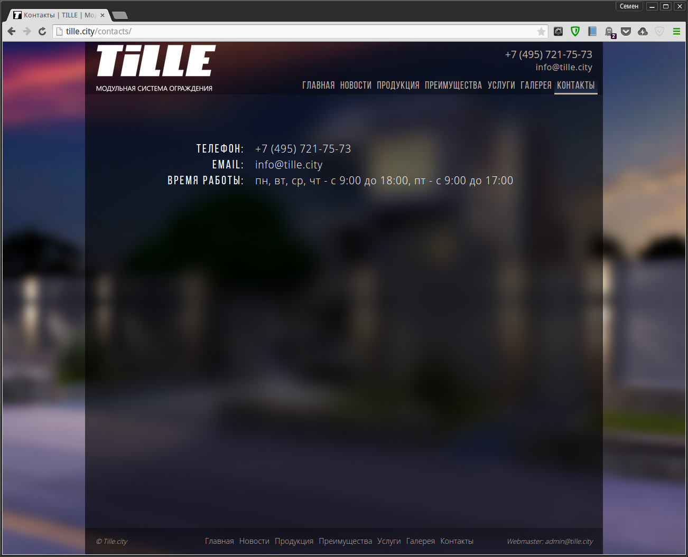

# TILLE.city web site

Simple Middleman web site with News and contact form.  
Contact form is provided by [Formspree].  

# Stack

* [Middleman]
* [Slim]
* [SCSS]
* jQuery [Jssor] slideshow plugin

# Requirements

1. [Ruby]
2. [Rubygems]
3. [Bundler]

# Workflow

1. Download/clone
2. Install dependencies: `bundle install`
3. Serve: `bundle exec middleman server`
4. Edit
5. Build: `bundle exec middleman build`
6. Deploy: `export MM_PASS=12345 && export TARGET=agava && bundle exec middleman deploy`

# Screenshots

  
  
  
  
  
  
  
  

[Ruby]: https://www.ruby-lang.org/ "Ruby"
[Rubygems]: https://rubygems.org/ "Rubygems"
[Bundler]: http://bundler.io/ "Bundler"
[Middleman]: https://middlemanapp.com/ "Middleman"
[Slim]: http://slim-lang.com/ "Slim"
[SCSS]: https://ru.wikipedia.org/wiki/Sass "SCSS"
[Jssor]: http://www.jssor.com/ "Jssor"
[Formspree]: http://formspree.io/ "Formspree"
